# IntelliMailPilot Project Detail, Module Flows, and Technology Stack

## 1. Project Overview

IntelliMailPilot, also named EmailBot in the repository, is a full-stack email operations platform for managing client data, campaign workflows, sender accounts, email drafts, mailbox activity, warm-up automation, reporting, credits, and role-based administration.

The active application is located in `dashboard-next/` and is built with Next.js App Router, React, MongoDB, Mongoose, Microsoft Graph, SMTP, and a persistent campaign worker model.

Core business objective:

- Import and manage client lists.
- Prepare campaign drafts and sender identities.
- Create, review, test, schedule, and execute email campaigns.
- Track recipient-level campaign activity.
- Support replies, reply-all, reminders, warm-up, reports, credits, and admin controls.

## 2. High-Level Architecture

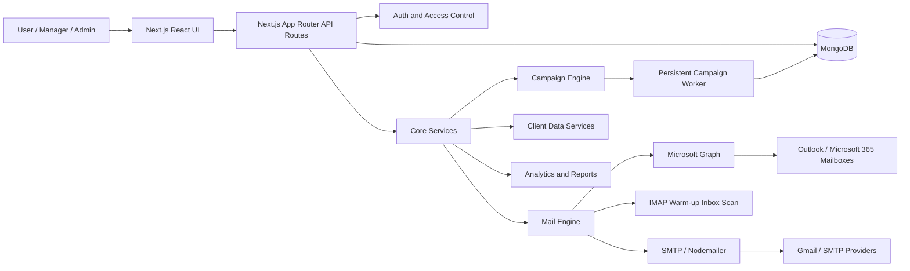

## 3. Technology Stack

| Layer | Technology | Usage |
|---|---|---|
| Frontend | Next.js 14.2.5, React 18.2.0 | Dashboard pages, campaign workflow, client data UI, drafts, reports, admin pages |
| Backend | Next.js App Router API routes | REST-like API endpoints under `app/api/**` |
| Database | MongoDB, Mongoose 8.18.0 | Persistent campaigns, users, clients, drafts, senders, credits, reports, warm-up data |
| Authentication | JWT, bcryptjs, cookies, custom auth helpers | Login, role access, API owner filtering |
| Email Sending | Microsoft Graph, nodemailer SMTP | Campaign sending, test email, mailbox reply, SMTP fallback |
| Mailbox Sync | Microsoft Graph mailbox APIs, IMAPFlow | Inbox, message cache, warm-up auto replies |
| Rich Text | TipTap editor packages | Draft creation and campaign email body editing |
| Spreadsheet Handling | xlsx | Client sheet import and parsing |
| Document Parsing | mammoth, pdfjs-dist | Draft/file text extraction support |
| UI Utilities | AG Grid, framer-motion | Data grids and interactive UI behavior |
| Deployment | Docker, PM2, standalone Next.js output | App deployment and separate campaign worker execution |

## 4. Repository Structure

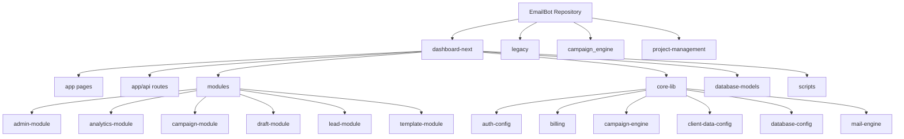

## 5. Main Application Flow

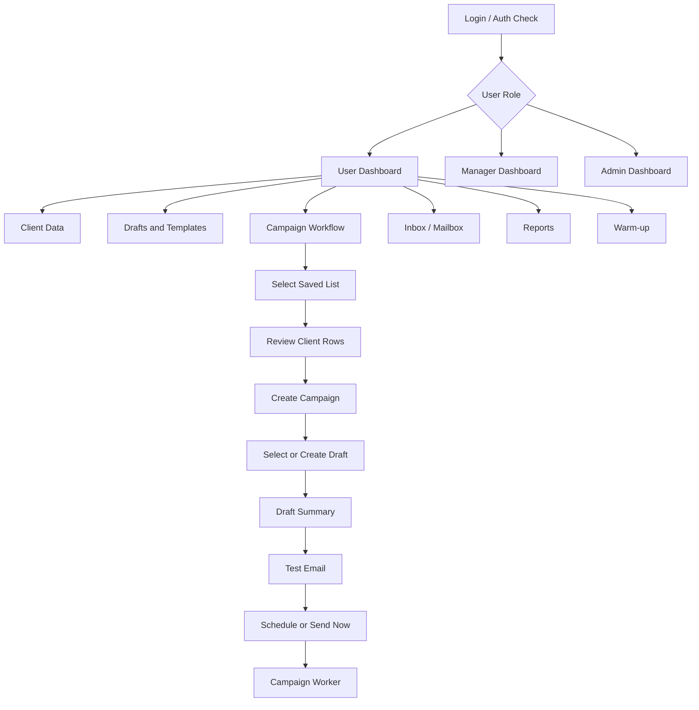

## 6. Module Details and Flows

### 6.1 Authentication and User Access Module

Purpose:

- Authenticate users.
- Protect API routes.
- Support role-based dashboard access.
- Filter data by authenticated owner/team scope.

Main areas:

- `app/api/auth/**`
- `app/login/page.js`
- `core-lib/auth-config/**`
- `database-models/UserProfile.js`
- `database-models/SignupRequest.js`

Flow:

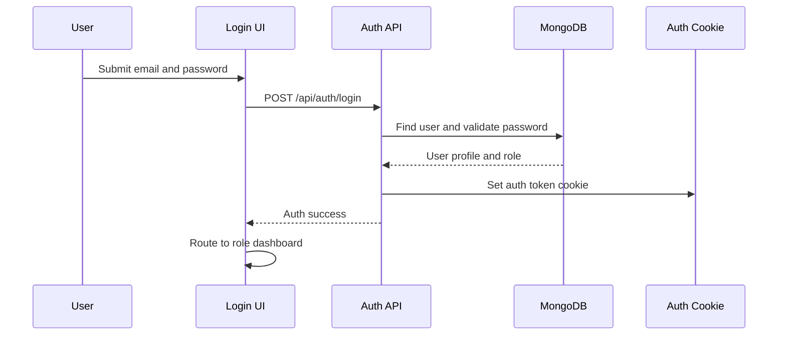

### 6.2 Dashboard Module

Purpose:

- Provide user, manager, and admin dashboard views.
- Show campaign status, stats, activities, reports, targets, and quick actions.
- Launch campaign workflow popups.

Main areas:

- `app/dashboard/page.js`
- `app/dashboard/user/page.js`
- `app/dashboard/manager/page.js`
- `app/dashboard/admin/page.js`
- `app/dashboard/DashboardClientPage.jsx`
- `app/dashboard/components/**`
- `app/api/dashboard/overview/route.js`
- `app/api/dashboard/activity/route.js`

Flow:

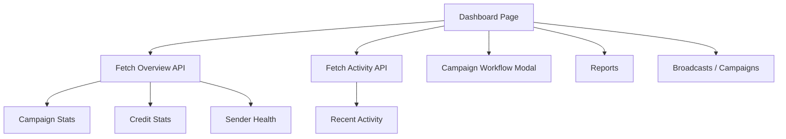

### 6.3 Client Data Module

Purpose:

- Upload, paste, create, review, normalize, and manage client data.
- Maintain sheets/lists for campaign use.
- Detect duplicates and manage bin/restore history.

Main areas:

- `app/client-data/**`
- `app/api/client-data/**`
- `app/api/client-sheets/**`
- `app/api/client-records/**`
- `database-models/LeadList.js`
- `database-models/ClientRecord.js`
- `database-models/ClientSheet.js`
- `database-models/ClientBinRecord.js`
- `database-models/UploadFile.js`

Flow:

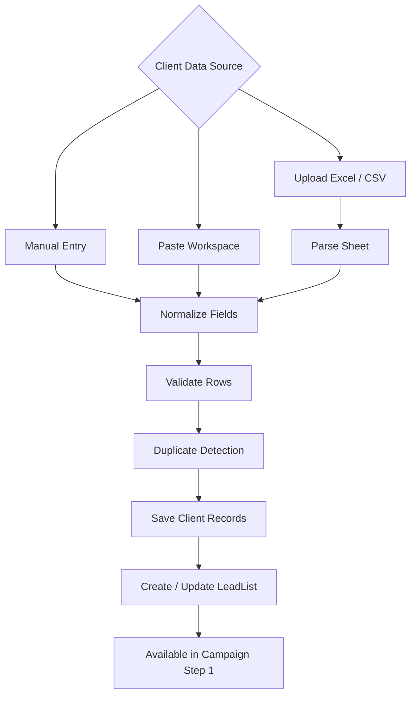

### 6.4 Campaign Workflow Module

Purpose:

- Guide the user through campaign setup from list selection to scheduling.
- Keep selected list, clients, campaign metadata, draft, test, and schedule connected.

Current workflow steps:

1. Upload List / Select Saved List
2. Review List
3. Create Campaign
4. Select Draft
5. Draft Summary
6. Test Email
7. Schedule

Main areas:

- `app/dashboard/components/PremiumDashboardShell.jsx`
- `app/dashboard/components/Workflow.jsx`
- `app/dashboard/components/WorkflowModal.css`
- `app/api/campaigns/**`
- `modules/campaign-module/campaign-components/CampaignDetailsDrawer.jsx`

Flow:

```mermaid
flowchart LR
  S1[Step 1 Select Saved Sheet] --> S2[Step 2 Review List]
  S2 --> S3[Step 3 Create Campaign]
  S3 --> S4[Step 4 Select or Create Draft]
  S4 --> S5[Step 5 Draft Summary]
  S5 --> S6[Step 6 Send Test Email]
  S6 --> S7[Step 7 Schedule or Send Now]
  S7 --> CampaignAPI[Campaign API]
  CampaignAPI --> CampaignDB[(Campaign Collection)]
  CampaignDB --> Worker[Campaign Worker]
```

Step 1 detailed flow:

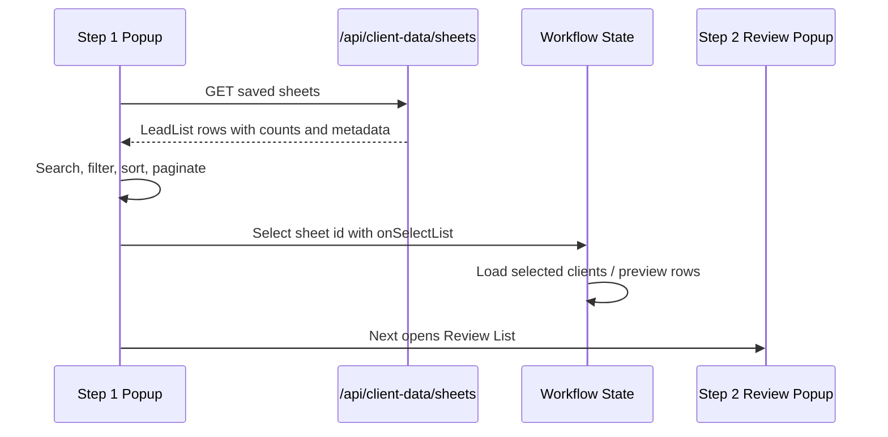

### 6.5 Draft and Template Module

Purpose:

- Manage reusable campaign drafts and templates.
- Support draft creation, editing, imported file text, and campaign draft selection.

Main areas:

- `app/drafts/page.js`
- `app/drafts/[id]/page.js`
- `app/draft-templates/page.js`
- `app/api/drafts/**`
- `app/api/templates/route.js`
- `app/api/draft-file-text/route.js`
- `modules/draft-module/**`
- `modules/template-module/**`
- `database-models/EmailDraft.js`
- `database-models/EmailTemplate.js`
- `database-models/MailDraft.js`

Flow:

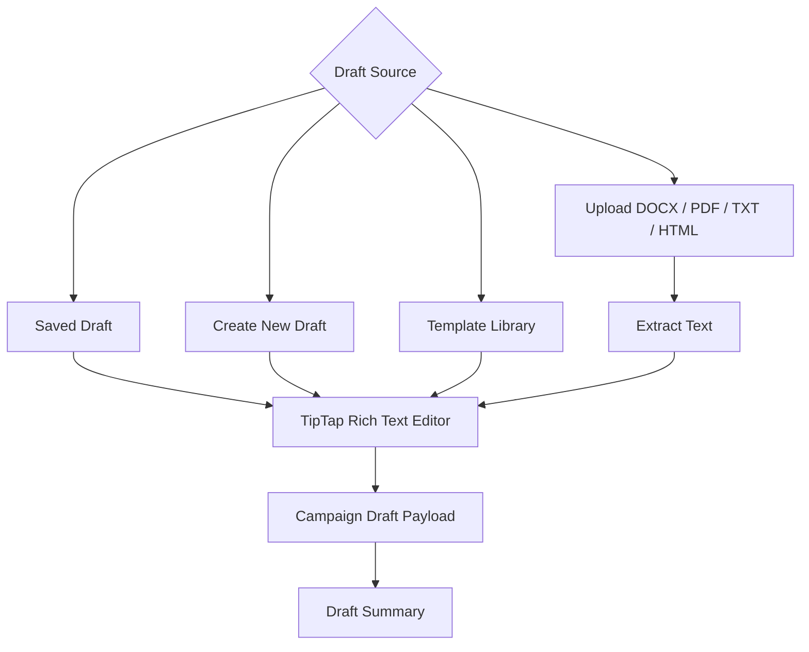

### 6.6 Campaign Execution Engine

Purpose:

- Execute scheduled and queued campaigns reliably outside short-lived serverless requests.
- Manage recipient claims, locks, credits, send attempts, status, and campaign rollups.

Main areas:

- `core-lib/campaign-engine/CampaignQueueScheduler.js`
- `core-lib/campaign-engine/CampaignExecutionRunner.js`
- `core-lib/campaign-engine/CampaignAnalyticsService.js`
- `core-lib/campaign-engine/CampaignStatusSummary.js`
- `scripts/campaign-worker.mjs`
- `app/api/worker/tick/route.js`
- `app/api/worker-health/route.js`

Flow:

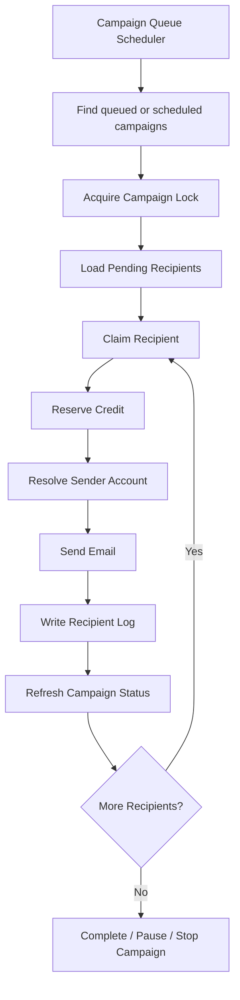

### 6.7 Sender Accounts and Mail Engine Module

Purpose:

- Resolve sender identity from DB accounts, preset senders, Microsoft OAuth accounts, and SMTP configuration.
- Send campaign, test, reply, and warm-up messages.

Main areas:

- `app/sender-emails/page.js`
- `app/api/sender-ids/route.js`
- `app/api/accounts/**`
- `app/api/preset-senders/route.js`
- `core-lib/mail-engine/SenderAccountResolver.js`
- `core-lib/mail-engine/GraphAndSmtpMailSender.js`
- `database-models/SenderId.js`
- `database-models/SenderAccount.js`
- `database-models/ConnectedMailAccount.js`
- `database-models/GraphOAuthAccount.js`
- `database-models/PresetSender.js`

Flow:

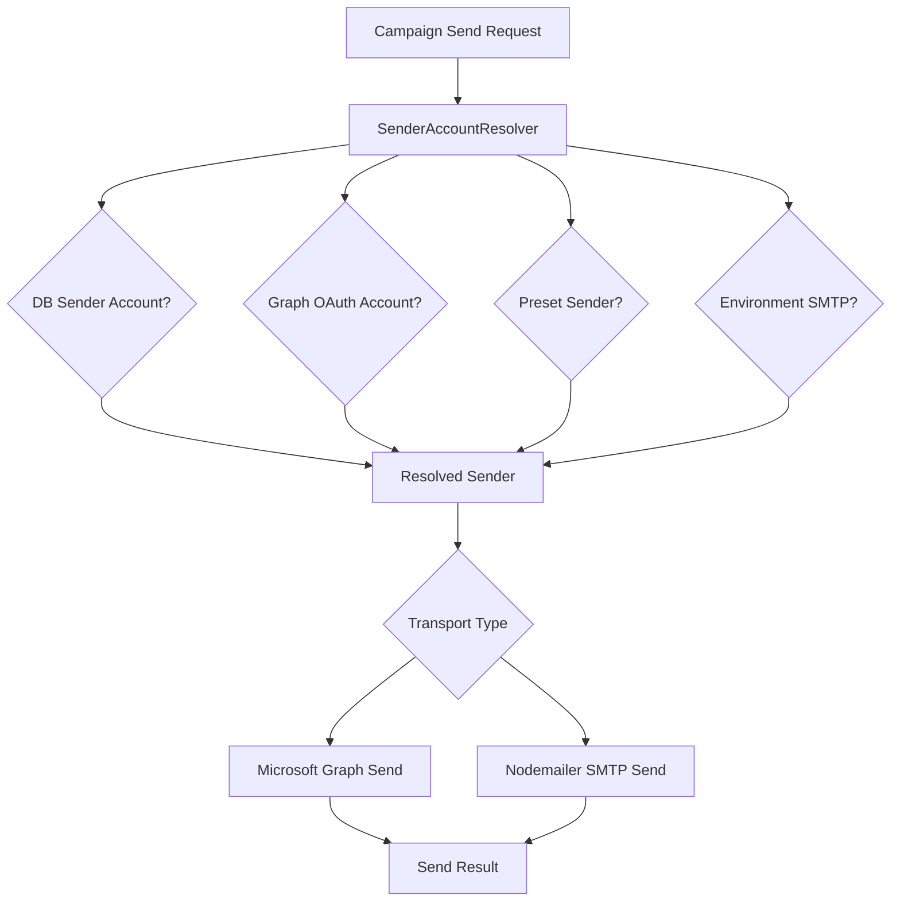

### 6.8 Microsoft Graph, Outlook, and Inbox Module

Purpose:

- Connect Microsoft accounts.
- Read mailbox folders/messages.
- Send, reply, forward, archive, delete, and mark messages read.
- Support campaign thread replies and reply-all actions.

Main areas:

- `app/mail-inbox/page.js`
- `app/user/master-inbox/page.js`
- `app/api/graph-oauth/**`
- `app/api/mailbox/**`
- `app/api/outlook/**`
- `core-lib/mail-engine/MicrosoftGraphMailboxService.js`
- `core-lib/mail-engine/MicrosoftGraphOAuthScopes.js`
- `core-lib/auth-config/TokenCryptoService.js`

Flow:

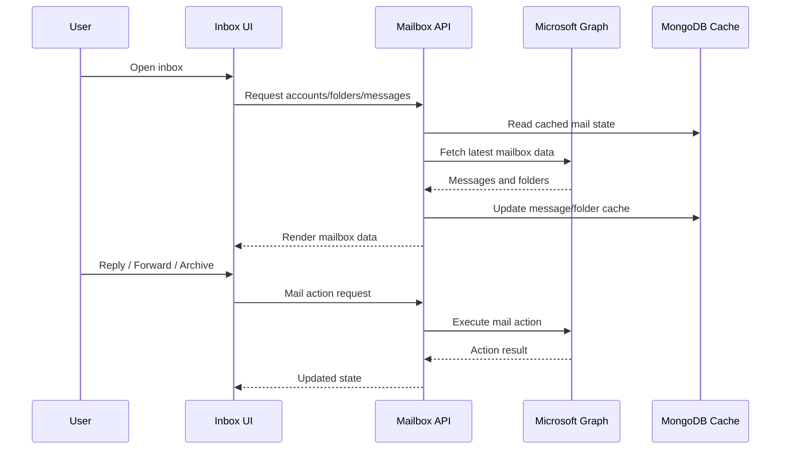

### 6.9 Reply, Reply-All, and Reminder Threading Module

Purpose:

- Preserve campaign email conversation context.
- Allow follow-up replies and reminders from campaign recipient history.
- Store message IDs and thread metadata for provider-compatible replies.

Main areas:

- `app/api/campaigns/[id]/replies/route.js`
- `app/api/campaigns/[id]/sync-replies/route.js`
- `app/api/mailbox/reply/route.js`
- `app/api/outlook/reply/route.js`
- `core-lib/mail-engine/CampaignThreadReplyService.js`
- `database-models/CampaignSentEmail.js`
- `database-models/EmailThread.js`
- `database-models/CampaignEmailReply.js`
- `database-models/CampaignReply.js`

Flow:

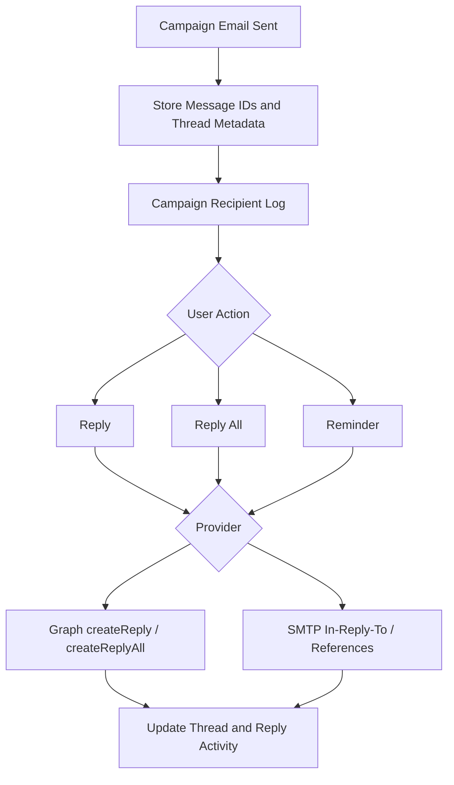

### 6.10 Warm-up Automation Module

Purpose:

- Manage warm-up sheets, warm-up leads, sender warm-up activity, auto communication, logs, and auto-reply handling.

Main areas:

- `app/warm-up/page.js`
- `app/api/warmup/**`
- `app/api/warmup-dashboard/route.js`
- `app/api/warmup-auto-reply/route.js`
- `database-models/WarmupSheet.js`
- `database-models/WarmupConversation.js`
- `database-models/WarmupMessage.js`
- `database-models/WarmupAutoReplyLog.js`
- `database-models/WarmupAutoReplySetting.js`

Flow:

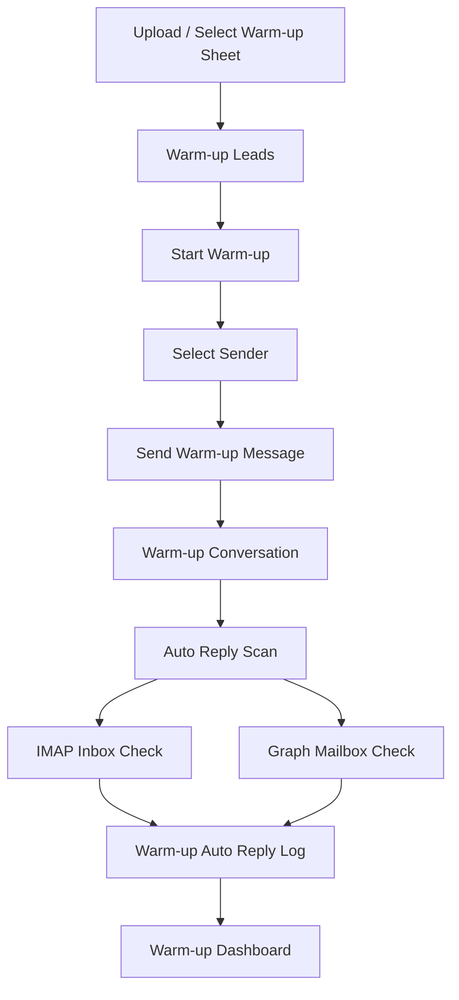

### 6.11 Reports and Analytics Module

Purpose:

- Provide operational reporting for campaign delivery, sender health, project performance, warm-up, credits, and summaries.

Main areas:

- `app/report/page.js`
- `app/summary/page.js`
- `app/api/reports/**`
- `app/api/campaigns/[id]/export/route.js`
- `core-lib/campaign-engine/CampaignAnalyticsService.js`

Flow:

```mermaid
flowchart TD
  ReportsPage[Reports Page] --> OverviewAPI[/api/reports/overview]
  ReportsPage --> ProjectAPI[/api/reports/project-wise]
  ReportsPage --> SenderAPI[/api/reports/sender-health]
  ReportsPage --> WarmupAPI[/api/reports/warmup]
  ReportsPage --> CreditsAPI[/api/reports/credits]
  OverviewAPI --> CampaignData[(Campaign Data)]
  ProjectAPI --> CampaignData
  SenderAPI --> SenderData[(Sender Data)]
  WarmupAPI --> WarmupData[(Warm-up Data)]
  CreditsAPI --> CreditData[(Credit Transactions)]
  CampaignData --> Charts[Report Charts and Tables]
  SenderData --> Charts
  WarmupData --> Charts
  CreditData --> Charts
```

### 6.12 Credits, Billing, and Subscription Module

Purpose:

- Track usage limits and campaign send credits.
- Reserve/refund credits during campaign execution.
- Support subscription plans and upgrade requests.

Main areas:

- `app/api/credits/route.js`
- `app/api/subscription/**`
- `app/api/billing/**`
- `app/api/admin/upgrade-requests/**`
- `core-lib/billing/**`
- `database-models/CreditTransaction.js`
- `database-models/UserSubscription.js`
- `database-models/UpgradeRequest.js`

Flow:

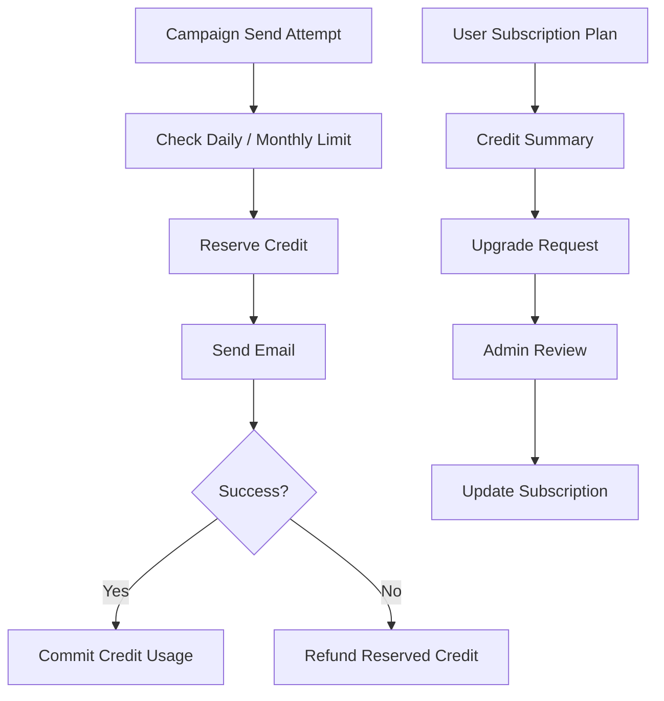

### 6.13 Admin Module

Purpose:

- Manage users, access requests, subscription status, pending approvals, and upgrade requests.
- View user campaigns, drafts, and client lists.

Main areas:

- `app/dashboard/admin/**`
- `app/api/admin/**`
- `modules/admin-module/**`
- `database-models/UserProfile.js`
- `database-models/SignupRequest.js`
- `database-models/TargetApproval.js`
- `database-models/UpgradeRequest.js`

Flow:

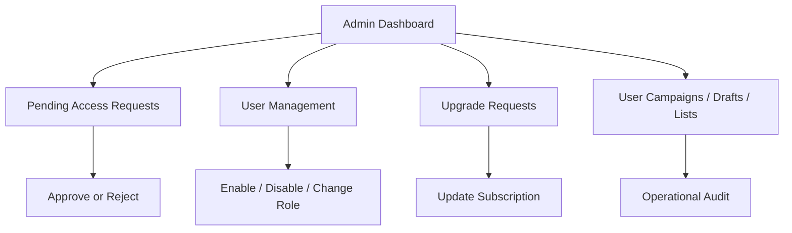

## 7. Key Database Model Groups

| Domain | Models |
|---|---|
| Campaigns | `Campaign`, `CampaignRecipientLog`, `CampaignRecipientClaim`, `CampaignSentEmail`, `RecipientSendLock`, `CampaignWorkerHeartbeat` |
| Replies and Threads | `CampaignEmailReply`, `CampaignReply`, `EmailThread` |
| Client Data | `LeadList`, `ClientRecord`, `ClientSheet`, `ClientBinRecord`, `UploadFile` |
| Drafts and Templates | `EmailDraft`, `EmailTemplate`, `MailDraft` |
| Sender and Mailbox | `SenderId`, `SenderAccount`, `ConnectedMailAccount`, `GraphOAuthAccount`, `PresetSender`, `MailFolderCache`, `MailMessageCache`, `MailSyncState` |
| Warm-up | `WarmupSheet`, `WarmupConversation`, `WarmupMessage`, `WarmupAutoReplyLog`, `WarmupAutoReplySetting` |
| Billing and Credits | `CreditTransaction`, `UserSubscription`, `UpgradeRequest` |
| Admin and Operations | `UserProfile`, `SignupRequest`, `TargetApproval`, `ActivityLogModel`, `TimelineTask`, `WorkUpdate`, `CalendarEvent`, `Project` |

## 8. API Surface Summary

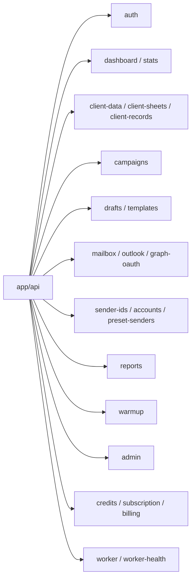

## 9. Deployment and Runtime Flow

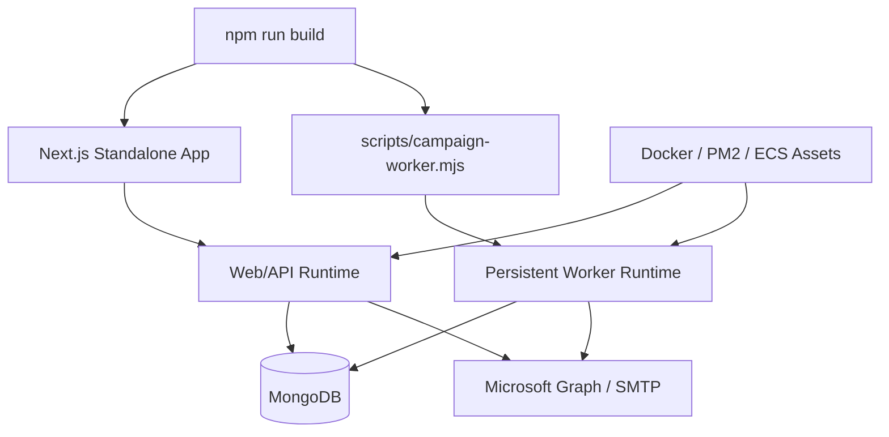

Runtime notes:

- Campaign sending should use the persistent campaign worker, not only a short-lived serverless request.
- Microsoft Graph features require correct OAuth/app credentials and token encryption secret.
- SMTP features require valid SMTP credentials/app passwords.
- MongoDB connection and auth environment variables must be configured before production use.

## 10. End-to-End Campaign Data Flow

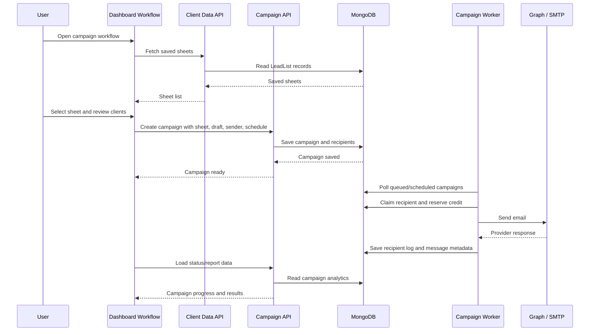

## 11. Current Implementation Status

Implemented areas:

- Role-aware dashboard.
- Client data upload, normalization, duplicate handling, saved lists, and campaign-ready sheets.
- Campaign workflow from list selection through schedule.
- Draft and template management.
- Sender identity management.
- Microsoft Graph and SMTP mail sending.
- Campaign worker execution model.
- Recipient-level logs, campaign analytics, replies, reply-all, reminders, and tracking metadata.
- Inbox/mailbox integration.
- Warm-up automation.
- Reports, credits, billing, subscription, and admin controls.

Important operational dependencies:

- MongoDB availability.
- Auth/JWT secrets.
- Microsoft Graph credentials and OAuth configuration.
- SMTP credentials for non-Graph sending.
- Persistent worker process for reliable campaign execution.
- Correct production environment variables and deployment separation between web runtime and worker runtime.

## 12. Recommended Verification Checklist

- Run `npm run build:clean` before release.
- Verify login and role routing.
- Upload and select a client sheet.
- Complete all seven campaign workflow steps.
- Send a test email through each configured sender type.
- Schedule a campaign and confirm worker execution.
- Check recipient logs, campaign status, and reports.
- Validate reply/reply-all/reminder from campaign detail drawer.
- Confirm warm-up start/stop and logs.
- Confirm admin approval, user status, subscription, and credits behavior.
