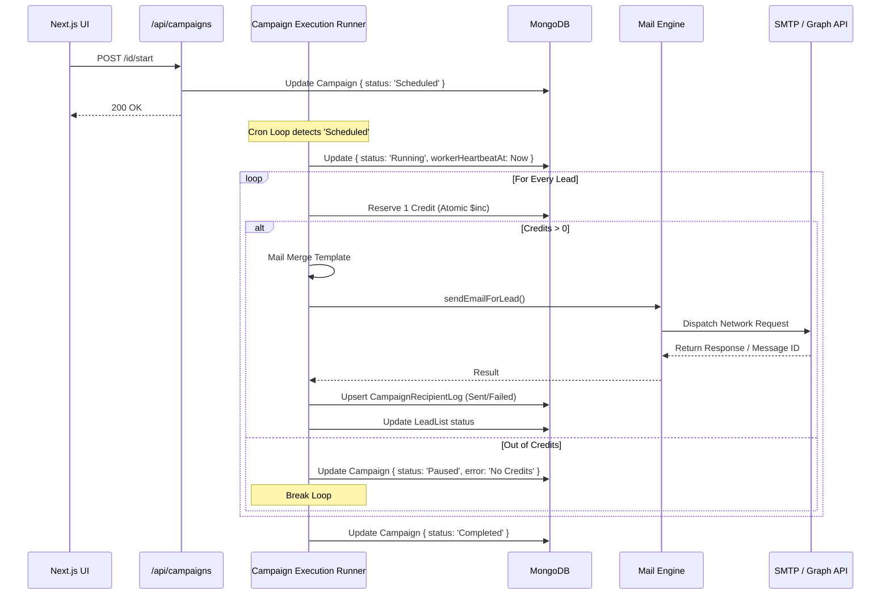
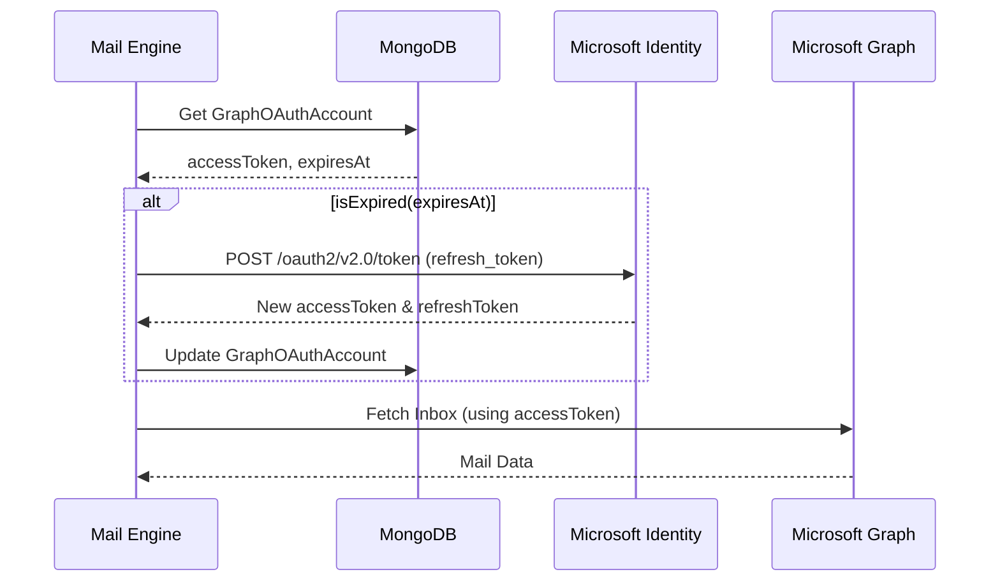

# EmailBot Ultimate System Architecture & Engineering Deep Dive

This document serves as the encyclopedic engineering manual for the EmailBot system. It comprehensively dissects the entire application layer by layer, explaining the precise mechanics of every module, background engine, API route, and database model.

---

## Chapter 1: The Authentication & Authorization Matrix

The security of EmailBot relies on a strictly typed Role-Based Access Control (RBAC) system implemented deeply across the Next.js frontend and Node.js backend.

### 1.1 The Role Hierarchy (`app/lib/dashboardRoles.js`)
*   **`USER`**: The baseline role. Operations are strictly scoped to the `userEmail` foreign key. A `USER` can only perform CRUD operations on `LeadList`, `EmailTemplate`, and `Campaign` documents where `userEmail` matches their JWT token.
*   **`MANAGER`**: The intermediate role. Has access to all `USER` privileges, plus the ability to query resources where `managerEmail` or `departmentId` matches their scope.
*   **`ADMIN`**: The absolute role. Bypasses standard `userEmail` constraints. Admins can hit specialized endpoints (e.g., `/api/admin/users/[id]/status`) to mutate the `UserProfile` status of any user in the system.

### 1.2 Authentication Flow Mechanics
1.  **Ingestion**: `<Login />` component (`app/login/page.js`) accepts credentials.
2.  **API Verification (`/api/auth/login`)**:
    *   **Fallback Checks**: Checks `.env` for `ADMIN_EMAIL` and `ADMIN_PASSWORD_HASH` for emergency access.
    *   **Database Check**: Queries the `UserProfile` collection for `identifier`.
    *   **Cryptographic Verification**: Executes `bcrypt.compareSync(password, profile.passwordHash)`.
3.  **Token Generation**: Uses `jsonwebtoken` to sign a payload: `{ id, email, role, iat, exp }`. The `exp` is typically set to 24-48 hours.
4.  **Cookie Attachment**: The token is serialized into a `Set-Cookie` header. Crucially, it is marked as `HttpOnly`, `Secure` (in production), and `SameSite=Strict` to prevent XSS and CSRF attacks.
5.  **Route Protection (`app/lib/roleRouting.js`)**: Middleware and Higher-Order Components (HOCs) wrap all `/dashboard/*` routes. If a `USER` attempts to access `/dashboard/admin`, the middleware instantly redirects them to `/dashboard/user` or `/unauthorized`.

---

## Chapter 2: Frontend UI & Modular Architecture

The Next.js frontend is divided into independent, scalable modules.

### 2.1 The Shared Component Ecosystem (`shared-components/`)
*   **`layout-components`**: `SharedAppLayoutShell.jsx` wraps the entire application. It maintains the layout state (sidebar collapsed/expanded) and renders `SharedSidebarNavigation.jsx` dynamically based on the `ROLE_NAVIGATION` constant.
*   **`ui-components`**: Atomic components like `UiDataTable.jsx` and `UiDialogModal.jsx`. These components do not hold global state or business logic; they only accept `props` and emit `events`, ensuring absolute reusability.

### 2.2 Campaign Wizard Module (`modules/campaign-module/`)
This is the most complex UI component, built as a multi-stage state machine.
*   **State Management**: Uses React `useState` and `useReducer` to manage the complex form payload across 4 steps.
*   **Step 1 (Audience)**: Fetches `LeadList` array. Allows user to select a list.
*   **Step 2 (Sender)**: Fetches connected `SenderAccount` items. Validates if the selected account has a `status === 'Connected'`.
*   **Step 3 (Content)**: Renders the `DraftEditor`. Allows insertion of `{{tags}}`. It uses a live preview mechanism by substituting tags with the first lead from the selected `LeadList`.
*   **Step 4 (Launch)**: Displays the summary. Clicking "Launch" hits `POST /api/campaigns`.

### 2.3 Lead Data Ingestion Module (`modules/lead-module/`)
*   **Client-Side Processing**: To prevent overwhelming the Next.js server, the `<FileUpload />` component uses the `xlsx` library to parse `.csv` or `.xlsx` files *in the browser*.
*   **Chunking**: It converts the file into an array of JSON objects.
*   **Transmission**: It sends the normalized array to `POST /api/client-data/create`.

---

## Chapter 3: The API Routing Matrix

EmailBot utilizes the Next.js App Router API directory (`app/api/`), organizing endpoints by resource domains.

### 3.1 The Campaign Controller (`/api/campaigns`)
*   **`POST /`**: Creates a campaign. **Database Mutation**: Inserts `Campaign` document.
*   **`GET /[id]`**: Retrieves campaign details. **Database Mutation**: Queries `Campaign` and populates related `EmailTemplate` and `LeadList`.
*   **`POST /[id]/start`**: **State Engine Trigger**. Updates `Campaign.status` to `Scheduled`. This alerts the `CampaignQueueScheduler` to pick it up.
*   **`POST /[id]/pause`**: Updates `Campaign.status` to `Paused`. The `CampaignExecutionRunner` checks this state between sending emails and gracefully halts the loop.
*   **`GET /tracking/open/[trackingId]`**: The Open Tracking Webhook.
    *   Returns a 1x1 transparent GIF (`Buffer.from('R0lGODlhAQABAIAAAAAAAP///yH5BAEAAAAALAAAAAABAAEAAAIBRAA7', 'base64')`).
    *   Mutates `CampaignRecipientLog` where `trackingId === req.params.trackingId` to `status = 'Opened'`.

### 3.2 The Mailbox Controller (`/api/mailbox`)
*   **`POST /accounts`**: Adds a new sender. If Microsoft Graph is selected, it returns an OAuth URL. The user is redirected, logs into Microsoft, and is sent to `/api/graph-oauth/callback`, which trades the code for an `accessToken` and `refreshToken` and saves it to `GraphOAuthAccount`.
*   **`GET /messages`**: Unified Inbox API. It checks the `SenderAccount.provider`. If SMTP, it connects via `imapflow` to fetch the inbox. If Graph, it hits `https://graph.microsoft.com/v1.0/me/messages`.

---

## Chapter 4: The Core Asynchronous Engines

The true complexity of EmailBot resides in `core-lib/`. These engines run asynchronously, independent of the HTTP request lifecycle.

### 4.1 The Campaign Scheduler (`CampaignQueueScheduler.js`)
*   **The Global Singleton**: Uses `global.campaignSchedulerState` to ensure only one instance of the scheduler runs, even in development with hot-reloading.
*   **The Heartbeat Mechanism**: Every 5 seconds, it queries: `Campaign.find({ status: { $in: ['Queued', 'Scheduled'] }, scheduledAt: { $lte: now } })`.
*   **Stale Worker Recovery**: A critical safety net. It runs `recoverStaleCampaigns()`. It looks for `Running` campaigns where `workerHeartbeatAt < now - 5 minutes`. If found, it assumes the Node process executing that campaign crashed (OOM, restart, etc.). It resets the campaign to `Queued` so a healthy worker can adopt it.

### 4.2 The Execution Runner (`CampaignExecutionRunner.js`)
When `startCampaignRunner()` is called, it executes the payload:
1.  **Preflight Validation**: `validateCampaignExecutionPreflight()` ensures the `LeadList` isn't empty, the `SenderAccount` is valid, and the user has sufficient credits.
2.  **The Loop**: It iterates over `LeadList.leads`.
3.  **Credit Reservation (`reserveCampaignCredit`)**: The most critical financial function.
    *   It uses Mongoose atomic operations: `$inc: { dailyRemainingCredits: -1, usedCredits: 1 }`.
    *   If `dailyRemainingCredits` hits 0, it aborts the loop.
    *   It creates a `CreditTransaction` document for the ledger.
4.  **The Mail Merge**: Extracts the template body and performs a Regex `replace` for variables like `{{First_Name}}` using the specific lead's data.
5.  **Thread Continuity**: Looks up `EmailThread`. If a previous email was sent to this lead, it injects the `In-Reply-To` and `References` headers so the new email appears in the exact same Gmail/Outlook thread.
6.  **Dispatch (`sendEmailForLead`)**: Calls `GraphAndSmtpMailSender.js`.
7.  **Error Classification (`classifyDeliveryFailure`)**:
    *   *5.1.1, user unknown, not found* -> Classifies as `Bounced`.
    *   *policy, blocked, spam* -> Classifies as `Spam`.
    *   *timeout, connection refused* -> Classifies as `Failed` (transient, might retry).
8.  **Logging**: Calls `upsertRecipientLogForLead()`, updating the massive `CampaignRecipientLog` document with the exact timestamp, status, and tracking ID.

### 4.3 The Warmup Engine (`WarmupAutoReplyService.js`)
*   **Purpose**: Artificially inflates sender reputation.
*   **Logic**: Periodically connects to the IMAP/Graph inbox. Scans for emails matching a specific warmup tag. If found, it marks them as read, moves them out of the spam folder (if applicable), and replies to a calculated percentage (`replyRatePercent`) using conversational AI/templates. Logs actions to `WarmupAutoReplyLog`.

---

## Chapter 5: Database Schemas (MongoDB Mongoose)

The data integrity of the system is maintained by strictly defined Mongoose schemas in `database-models/`.

### 5.1 Identity & Billing
*   **`UserProfile`**: Primary Key `_id`. Contains `identifier` (unique email), `role` (enum), `totalCredits`, `usedCredits`.
*   **`UserSubscription`**: Linked via `userEmail`. Contains `planId`, `dailyRemainingCredits`, `lastDailyResetAt`. *The engine strictly relies on this for rate limiting.*
*   **`CreditTransaction`**: The immutable ledger. `type` ('debit' | 'credit'), `credits` (Number), `reason`, `balanceAfter`.

### 5.2 The Campaign Ecosystem
*   **`LeadList`**: Contains `userEmail`, `name`, and an embedded array `leads: [{ email, data (Map), status, error, threadId }]`.
*   **`EmailTemplate`**: Contains `userEmail`, `name`, `subject`, `body` (HTML string).
*   **`Campaign`**: The Orchestrator. 
    *   Foreign Keys: `userId`, `listId`, `templateId`, `senderAccountId`.
    *   State Fields: `status` ('Draft', 'Scheduled', 'Running', 'Paused', 'Completed'), `sentCount`, `pendingCount`, `failedCount`.
    *   Engine Fields: `workerId`, `workerHeartbeatAt`, `queueRequestedAt`.
*   **`CampaignRecipientLog`**: Massive historical log.
    *   Fields: `campaignId`, `recipientEmail`, `status`, `failureReason`.
    *   Embedded Array: `stepLogs` (Tracks multi-step drip campaigns. `{ stepNumber, status, sentAt, trackingId }`).

### 5.3 External Integrations
*   **`SenderAccount`**: Unified credentials. `provider` (String: 'smtp' | 'graph'), `host`, `port`, `user`, `pass`, `status`.
*   **`GraphOAuthAccount`**: Microsoft specific. `accessToken`, `refreshToken`, `tenantId`, `expiresAt`.

---

## Chapter 6: Data Flow Architecture Diagrams

### 6.1 The Campaign Execution Pipeline

### 6.2 The Token Refresh & Sync Pipeline

---

## Conclusion of Deep Dive

This architectural documentation represents the absolute blueprint of the EmailBot system. From the frontend RBAC middleware to the specific Mongoose `$inc` atomic operators reserving financial credits, the system is designed for high concurrency, failure recovery (via heartbeat tracking), and immense scalability.
